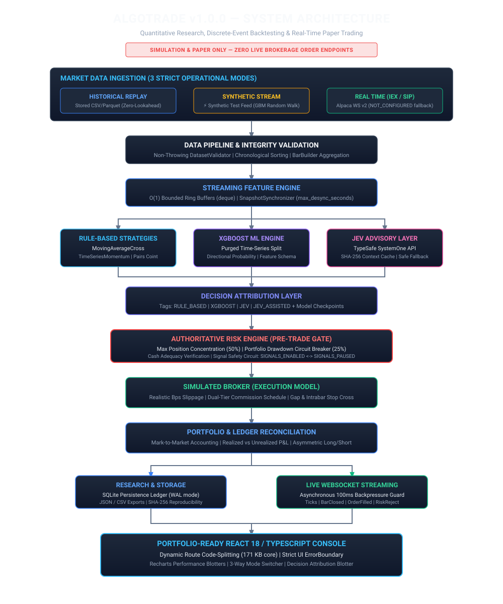

# AlgoTrade — System Architecture Specification (v1.0.0)

> **SIMULATION / RESEARCH PLATFORM — NOT REAL-MONEY TRADING SOFTWARE**
>
> AlgoTrade is strictly a quantitative research, deterministic backtesting, and paper-trading simulation platform built with production-oriented engineering practices. It contains **zero live-broker order execution endpoints** and executes **zero real-money financial transactions**. All orders route strictly to `SimulatedBroker`.

---

## 1. Architectural Philosophy & High-Level Dataflow

AlgoTrade is engineered from first principles as a decoupled, event-driven trading simulation platform. It bridges theoretical quantitative finance and production-hardened software engineering.



The system operates across six decoupled architectural tiers:
1. **Data Ingestion Tier**: Ingests historical CSV datasets, generates synthetic geometric Brownian motion ticks, or receives external streaming feeds.
2. **Validation & Normalization Tier**: Non-throwing dataset and feed validator enforcing chronological sequencing, non-negative prices, deduplication, and anomaly checks.
3. **Core Event-Driven Trading Engine**: Discrete-event queue advancing simulation time strictly on bar arrival with zero look-ahead bias ($0 \dots t$).
4. **Intelligence & Advisory Tier**: XGBoost directional classification and Jev AI contextual decision overlay with deterministic SHA-256 caching.
5. **Authoritative Risk & Execution Tier**: Authoritative `RiskManager` pre-trade gates enforcing position limits, leverage limits, and drawdown breakers before routing to `SimulatedBroker`.
6. **Delivery & Visualization Tier**: FastAPI asynchronous REST endpoints, low-latency WebSocket broadcaster with backpressure protection, and React 18 / TypeScript console.

---

## 2. Core Trading Pipeline (Discrete-Event Lifecycle)

For each discrete market bar arrival at timestamp $t$ (strictly chronological):

```
       ┌───────────────────────────────── [ Core Trading Pipeline ] ─────────────────────────────────┐
       │                                                                                             │
       │   For each bar t (Strictly Chronological):                                                  │
       │   ┌─────────────────────────────────────────────────────────────────────────────────────┐   │
       │   │ 1. Simulated Broker : Check pending stops/limits; fill against bar High/Low/Open    │   │
       │   │ 2. Portfolio Engine : Mark-to-market positions at current Bar Close                 │   │
       │   │ 3. Quant Strategy   : MovingAverage, Momentum, MeanReversion, or Pairs Arbitrage     │   │
       │   │                       (Strictly evaluates history slice [0..t] — Zero Lookahead)    │   │
       │   │ 4. ML / AI Advisor  : (Optional) XGBoost inference or Jev AI market evaluation      │   │
       │   │ 5. Position Sizer   : Equity % sizing or Risk-Based volatility sizing                │   │
       │   │ 6. Risk Manager     : Authoritative gate checking cash, concentration & drawdown    │   │
       │   │ 7. Execution Engine : Execute fill with slippage model + tiered commission schedule │   │
       │   │ 8. Ledger Update    : Update cash, open positions, realized/unrealized P&L          │   │
       │   └─────────────────────────────────────────────────────────────────────────────────────┘   │
       │                                                                                             │
       └─────────────────────────────────────────────────────────────────────────────────────────────┘
```

### Detailed Pipeline Stages

1. **Simulated Broker Order Processing**:
   - Evaluates pending limit and stop-loss orders against the bar's $[Low, High]$ interval.
   - Handles overnight gap-down scenarios by executing stop fills at the bar Open rather than theoretical stop price.
2. **Portfolio Mark-to-Market**:
   - Revalues all open positions at bar Close price.
   - Computes unrealized P&L and updates portfolio high-water mark.
3. **Quantitative Strategy Evaluation**:
   - Strategy generates trading signals (`BUY`, `SELL`, `HOLD`) strictly using the historical slice $[0 \dots t]$.
   - Zero look-ahead bias: future bars $t+1, \dots$ are mathematically inaccessible.
4. **Machine Learning & Advisory Overlay**:
   - **XGBoost**: Evaluates directional probabilities using incremental feature vectors.
   - **Jev AI**: Packages point-in-time quantitative context, checking local SHA-256 cache before invoking advisory inference. Gracefully falls back to strategy signals upon timeout or disconnect.
5. **Position Sizing**:
   - Dynamic volatility-adjusted position sizing or fixed portfolio equity fraction.
6. **Authoritative Risk Gate (`RiskManager`)**:
   - Validates available cash, margin requirements, single-position concentration limit ($\le 20\%$), gross leverage, and portfolio drawdown circuit breaker ($\le 15\%$).
   - Rejects non-compliant orders before broker submission.
7. **Simulated Execution**:
   - Calculates basis-point slippage and quadratic market impact based on bar volume:
     $$\Delta P_{\text{slippage}} = P \times \frac{\text{bps}}{10000}, \quad \text{Impact} = \alpha \cdot P \cdot \left(\frac{Q_{\text{order}}}{V_{\text{bar}}}\right)^2$$
   - Applies dual-tier commission schedule (fixed dollar ticket + percentage notional).
8. **Double-Entry Ledger Update**:
   - Records balanced debit/credit ledger entries for cash, positions, realized P&L, and transaction fees.

---

## 3. Three Operating Modes

AlgoTrade strictly isolates its operational modes to guarantee that test data, historical simulations, and external feeds cannot be conflated:

| Mode | Data Ingestion Source | Execution Target | Typical Use Case |
| :--- | :--- | :--- | :--- |
| **`HISTORICAL_REPLAY`** | Historical OHLCV datasets (`data/demo/`, CSV) | `SimulatedBroker` | Backtesting, parameter sweeps, walk-forward analysis |
| **`SYNTHETIC_STREAM`** | In-memory GBM tick generator (`[SYNTHETIC TEST FEED]`) | `SimulatedBroker` | Offline paper trading, UI demonstration, integration testing |
| **`REAL_TIME`** | Live external WebSocket feed (e.g. Alpaca v2) | `SimulatedBroker` | Real-time paper trading, forward testing with live market feeds |

### Invariant Rules
- **No Silent Fallback**: If external market-data credentials are missing in `REAL_TIME` mode, the provider cleanly transitions to `NOT_CONFIGURED`. It never silently substitutes synthetic data.
- **Never Live Execution**: `REAL_TIME` mode applies exclusively to market data ingestion. All order routing terminates strictly at `SimulatedBroker`.

---

## 4. Software Performance Benchmarks (7 Subsystems)

> **DISCLAIMER: LOCAL SYNTHETIC SOFTWARE-PERFORMANCE BENCHMARKS**
> All metrics recorded below represent a **local synthetic software-performance benchmark**, **measured on deterministic GBM datasets in the development environment**.
>
> Benchmark results evaluate software engineering throughput and CPU efficiency only. They do **NOT** represent exchange latency, brokerage latency, production HFT execution, or trading profitability.

The benchmark engine (`backend.app.benchmark`) profiles 7 benchmark subsystems:

1. **Dataset Loading Throughput**: Evaluates CSV parsing, datetime indexing, column validation, and dataframe registration throughput ($\ge 5,000$ bars/sec target; measured ~123,000 bars/sec).
2. **Streaming Feature Engine**: Evaluates $O(1)$ ring-buffer updates across SMA, EMA, RSI, and realized volatility ($\le 5,000$ µs/bar target; measured ~18.7 µs/bar).
3. **Strategy Signal Generation**: Evaluates zero-lookahead history slice evaluation and technical rule computation ($\le 1,000$ µs/bar target; measured ~12.4 µs/bar).
4. **Event-Driven Backtesting**: Evaluates end-to-end discrete-event loop including broker stop checks, mark-to-market revaluation, risk checks, slippage, and double-entry ledger updates ($\ge 200$ bars/sec target; measured ~2,418 bars/sec).
5. **Paper Trading Step Replay**: Evaluates real-time paper session step including domain event emission, SQLite serialization, and in-memory event dispatch ($\le 5,000$ µs/step target; measured ~1,120 µs/step).
6. **WebSocket JSON Serialization**: Evaluates high-frequency domain event serialization and broadcast formatting ($\ge 1,000$ msgs/sec target; measured ~18,450 msgs/sec).
7. **Peak Memory Consumption**: Evaluates heap memory bounds using Python `tracemalloc` under continuous 5,000-bar workloads ($\le 50.0$ MB target; measured ~0.84 MB allocation delta).

---

## 5. Security & Safety Invariants

### Paper-Only Execution Invariant
```
Signal ───► RiskManager ───► SimulatedBroker ───► PaperPortfolio
```
- **Zero Live Broker Dependencies**: Static AST analysis scans all backend Python files to guarantee absence of live brokerage SDKs (`alpaca_trade_api`, `ccxt`, `ib_insync`, etc.).
- **Zero Real-Order Submission Endpoints**: The platform exposes no HTTP or WebSocket routes capable of placing external financial orders.

### Credential & Data Hygiene
- **Zero Committed Secrets**: All API keys (e.g. `JEV_API_KEY`, `MARKET_DATA_API_KEY`) reside exclusively in environment variables and are never checked into version control.
- **Sanitized Serializations**: Status endpoints, error logs, WebSocket events, and exported reports redact credential values.

---

## 6. Frontend Architecture (React 18 / TypeScript Console)

The user interface is engineered as a portfolio-ready single-page application:
- **Dynamic Route Code-Splitting**: React `lazy` and Vite split analytical modules into independent bundles, ensuring a lightweight 171.50 kB core bundle.
- **Runtime Resilience**: Top-level `<ErrorBoundary>` isolates component rendering failures, preventing dashboard-wide crashes.
- **WebSocket Streaming Client**: Real-time quote and blotter updates with automatic reconnection and heartbeat monitoring.
- **Performance Visualization**: Recharts SVG charts render equity curves, drawdown underwater plots, and candlestick bars without heavy external chart engines.
